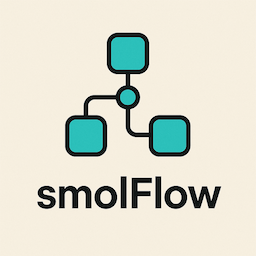

# smolFlow Framework

[](https://opensource.org/licenses/MIT)
[](#)
<!-- Add other badges like build status, npm version if applicable -->



smolFlow is a lightweight JavaScript framework that uses a **node-based** approach to orchestrate synchronous and asynchronous workflows. It is particularly well-suited for building multi-step agents, data processing pipelines, or any application requiring a sequence of operations with conditional logic, retry mechanisms, and a shared context. The design is inspired by graph-based execution models and promotes clear separation of concerns. It draws inspiration from concepts discussed in articles like ["LLM Agent Internal as a Graph: Tutorial for Dummies"](https://medium.com/@zh2408/llm-agent-internal-as-a-graph-tutorial-for-dummies-9d80d2d46547) and minimalist workflow engines such as PocketFlow.

smolFlow is self-contained with no external dependencies for its core functionality.

## Table of Contents

*   [Features](#features)
*   [Core Concepts](#core-concepts)
    *   [Nodes (The Building Blocks)](#nodes-the-building-blocks)
    *   [Flows (Orchestrators)](#flows-orchestrators)
    *   [Shared Context](#shared-context)
    *   [Transitions](#transitions)
    *   [Retry Mechanism](#retry-mechanism)
    *   [Error Handling](#error-handling)
    *   [Batch Processing](#batch-processing)
*   [Installation](#installation)
*   [Getting Started](#getting-started)
    *   [1. Include `smolflow.js`](#1-include-smolflowjs)
    *   [2. Define Your Nodes](#2-define-your-nodes)
    *   [3. Define Your Flow](#3-define-your-flow)
    *   [4. Run the Flow](#4-run-the-flow)
*   [API Overview](#api-overview)
    *   [Main Classes](#main-classes)
    *   [Utility Functions (`FlowFramework.utils`)](#utility-functions-flowframeworkutils)
*   [Example Application: AI Search Agent](#example-application-ai-search-agent)
*   [Customization & Extension](#customization--extension)
*   [Contributing](#contributing)
*   [License](#license)

## Features

*   **Synchronous & Asynchronous Operations**: Supports both `Node` for synchronous tasks and `AsyncNode` for `async/await` based tasks.
*   **Node-Based Architecture**: Promotes modularity and clear separation of concerns with `BaseNode` as the foundation.
*   **Flow Orchestration**: Manage complex sequences of nodes using `Flow` (for synchronous nodes) and `AsyncFlow` (for asynchronous nodes).
*   **Stateful Flows with Shared Context**: Easily manage and pass data between nodes using a shared JavaScript object.
*   **Conditional Transitions**: Direct the flow based on the outcomes of nodes using action strings. Fluent API with `node.withTransition("action").connect(nextNode)`.
*   **Built-in Retry Mechanism**: `Node` and `AsyncNode` support configurable retries with delays for their execution phase.
*   **Customizable Error Handling**: Implement `execFallback` (for `Node`) or `execFallbackAsync` (for `AsyncNode`) for custom logic after all retries are exhausted.
*   **Batch Processing**:
    *   **Nodes**: `BatchNode` (sync), `AsyncBatchNode` (async sequential), `AsyncParallelBatchNode` (async parallel) for processing arrays of items.
    *   **Flows**: `BatchFlow` (sync), `AsyncBatchFlow` (async sequential), `AsyncParallelBatchFlow` (async parallel) for running a flow multiple times with different parameter sets.
*   **Lightweight and Minimalistic**: No external dependencies for the core framework.
*   **Flexible**: Suitable for various applications, from LLM agents to data processing pipelines and general automation.
*   **Utility Functions**: Includes helpers like `deepCopy` and a configurable warning system.
*   **Broad Compatibility**: Works in Node.js environments and modern browsers (exposes `window.FlowFramework`). Supports CommonJS and ES module patterns.

## Core Concepts

### Nodes (The Building Blocks)

Nodes are individual units of work. smolFlow provides several base classes for creating nodes:

*   **`FlowFramework.BaseNode`**: The fundamental class for all nodes.
    *   `prep(shared)`: Synchronous method to prepare data or context. Receives the `shared` context.
    *   `exec(prepRes)`: Synchronous method for the node's primary logic. Receives result from `prep`.
    *   `post(shared, prepRes, execRes)`: Synchronous method called after `exec`. Its return value (an action string) typically determines the next node.
*   **`FlowFramework.Node` (extends `BaseNode`)**: For synchronous tasks with built-in retry logic.
    *   `constructor(maxRetries = 1, waitInSeconds = 0)`: Configures retries and wait time.
    *   `execFallback(prepRes, error)`: Called if `exec` fails after all retries.
*   **`FlowFramework.AsyncNode` (extends `Node`)**: For asynchronous tasks using `async/await`, with retry logic.
    *   `constructor(maxRetries = 1, waitInSeconds = 0)`
    *   `async prepAsync(shared)`
    *   `async execAsync(prepRes)`
    *   `async postAsync(shared, prepRes, execRes)`
    *   `async execFallbackAsync(prepRes, error)`

### Flows (Orchestrators)

Flows manage the execution sequence of nodes.

*   **`FlowFramework.Flow` (extends `BaseNode`)**: Orchestrates synchronous `Node` instances.
    *   `start(node)`: Defines the entry point (first node).
    *   `run(shared)`: Executes the flow.
*   **`FlowFramework.AsyncFlow` (extends `Flow`, mixes `AsyncNode` capabilities)**: Orchestrates `AsyncNode` instances (and can also run synchronous `Node`s).
    *   `start(node)`: Defines the entry point.
    *   `async runAsync(shared)`: Executes the flow.

### Shared Context

A JavaScript object (`shared`) passed through the flow. Nodes can read from and write to this object, allowing them to share data, state, and configuration dynamically. Use `FlowFramework.utils.deepCopy` if you need to pass isolated copies of parts of the shared context to certain nodes.

### Transitions

The `post` (or `postAsync`) method of a node returns an "action" string. The `Flow` (or `AsyncFlow`) uses this action string to determine the next node to execute based on connections defined using:
*   `someNode.next(nextNode, 'actionName')`
*   Or fluently: `someNode.withTransition('actionName').connect(nextNode)`

If an action string is returned for which no transition is defined, the flow typically ends. A default transition can be defined using `someNode.next(nextNode)` (which is equivalent to `someNode.next(nextNode, 'default')`).

### Retry Mechanism

Both `Node` and `AsyncNode` support automatic retries for their `exec` (or `execAsync`) phase. The constructor `new Node(maxRetries, waitInSeconds)` allows specifying:
*   `maxRetries`: The total number of attempts (1 means no retries).
*   `waitInSeconds`: The time to wait between retry attempts. For `AsyncNode`, this is an actual `await`ed delay. For `Node`, a warning is issued if used in a browser context for synchronous waits.

The `this.curRetry` property within a node indicates the current attempt number (0-indexed).

### Error Handling

If `exec` (or `execAsync`) throws an error, the retry mechanism engages. If all retries are exhausted and the error persists, the `execFallback` (or `execFallbackAsync`) method is called.
*   `execFallback(prepRes, error)` for `Node`.
*   `async execFallbackAsync(prepRes, error)` for `AsyncNode`.
By default, these methods re-throw the error, which will propagate up from the `flow.run()` or `flow.runAsync()` call. You can override them to implement custom error handling or recovery logic.

### Batch Processing

smolFlow includes specialized nodes and flows for processing collections of items or parameters:

*   **Batch Nodes**:
    *   `FlowFramework.BatchNode`: Synchronously processes an array of items, calling `exec` for each.
    *   `FlowFramework.AsyncBatchNode`: Asynchronously processes an array of items sequentially (one after another).
    *   `FlowFramework.AsyncParallelBatchNode`: Asynchronously processes an array of items in parallel (`Promise.all`).
*   **Batch Flows**:
    *   `FlowFramework.BatchFlow`: Runs a synchronous flow multiple times, once for each parameter set provided by its `prep` method.
    *   `FlowFramework.AsyncBatchFlow`: Runs an asynchronous flow multiple times sequentially for each parameter set from `prepAsync`.
    *   `FlowFramework.AsyncParallelBatchFlow`: Runs an asynchronous flow multiple times in parallel for each parameter set from `prepAsync`.

## Installation

Currently, smolFlow is used by directly including the `src/smolflow.js` file in your project.

**Browser:**
```html
<script src="path/to/src/smolflow.js"></script>
<script>
  // FlowFramework is available on window.FlowFramework
  const myNode = new FlowFramework.AsyncNode();
  // ...
</script>
```

**Node.js:**
```javascript
const FlowFramework = require('./path/to/src/smolflow.js');
// or using ES modules:
// import FlowFramework from './path/to/src/smolflow.js'; // if smolflow.js is adapted or a build step is used

const myNode = new FlowFramework.AsyncNode();
// ...
```
(Note: For native ES module support in Node.js without a build step, `smolflow.js` might need slight adjustments to its export patterns or you'd use a transpiler.)

In the future, smolFlow might be available as an npm package.

## Getting Started

Here's how to set up and run a simple asynchronous flow:

### 1. Include `smolflow.js`

As described in the [Installation](#installation) section.

### 2. Define Your Nodes

Create classes that extend `FlowFramework.AsyncNode` (for async tasks) or `FlowFramework.Node` (for sync tasks).

```javascript
class MyCustomNode extends FlowFramework.AsyncNode {
    constructor(name, maxRetries = 1, waitInSeconds = 0) {
        super(maxRetries, waitInSeconds);
        this.name = name;
    }

    async prepAsync(shared) {
        console.log(`${this.name}: Preparing... Current shared value:`, shared.someValue);
        // Optionally modify shared context or prepare data for execAsync
        shared.prepTimestamp = Date.now();
        return { message: `Prep data for ${this.name}` };
    }

    async execAsync(prepRes) {
        console.log(`${this.name}: Executing with:`, prepRes.message);
        
        // Simulate an async task
        await new Promise(resolve => setTimeout(resolve, 100 + Math.random() * 100));

        // Simulate a transient error to demonstrate retry
        if (this.name === "Node1" && Math.random() < 0.7 && this.curRetry < this.maxRetries - 1) {
            console.warn(`${this.name}: Simulating error on attempt ${this.curRetry + 1}/${this.maxRetries}`);
            throw new Error("Simulated transient error in Node1");
        }
        
        return { resultData: `${this.name} execution successful` };
    }

    async postAsync(shared, prepRes, execRes) {
        console.log(`${this.name}: Post-processing result:`, execRes.resultData);
        shared.lastNodeResult = execRes.resultData;
        shared.lastNodeName = this.name;

        // Conditional transitioning
        if (shared.someValue > 10 && this.name === "Node1") {
            return "goToEnd"; // Action string for transition
        }
        if (this.name === "Node1") {
            return "goToNode2";
        }
        if (this.name === "Node2") {
            return "repeatNode1";
        }
        return "defaultEnd"; // Default action if no other condition met
    }

    async execFallbackAsync(prepRes, error) {
        console.error(`${this.name}: All retries failed. Error: ${error.message}. Prep result was:`, prepRes);
        // Optionally, perform cleanup or set a specific state in shared context
        shared.errorState = `${this.name} failed permanently.`;
        return "fallbackAction"; // Or re-throw error: throw error;
    }
}

class EndProcessingNode extends FlowFramework.AsyncNode {
    async execAsync(prepRes) {
        console.log("EndProcessingNode: Flow has reached a terminal state.");
        return "done";
    }
}
```

### 3. Define Your Flow

Instantiate your nodes and connect them using `AsyncFlow`.

```javascript
// Instantiate nodes
const node1 = new MyCustomNode("Node1", 3, 1); // Max 3 attempts, 1s wait between retries
const node2 = new MyCustomNode("Node2");
const endNode = new EndProcessingNode();

// Create and configure the flow
const myFlow = new FlowFramework.AsyncFlow();

myFlow.start(node1); // Set node1 as the starting point

// Define transitions based on action strings returned by postAsync
node1.next(node2, "goToNode2");
node1.next(endNode, "goToEnd");
node1.next(endNode, "fallbackAction"); // Handle fallback from Node1

node2.next(node1, "repeatNode1");
node2.next(endNode, "defaultEnd"); // If Node2 returns 'defaultEnd'

// endNode is a terminal node in this setup as it doesn't define further .next() transitions.
// Its postAsync can return an action, but if myFlow.getNextNode() doesn't find a match, the flow stops.
```

### 4. Run the Flow

Initialize a `shared` context object and run the flow.

```javascript
const sharedContext = {
    someValue: 5,
    // other initial data
};

console.log("Starting flow with initial context:", JSON.stringify(sharedContext));

myFlow.runAsync(sharedContext)
    .then((finalAction) => {
        console.log("Flow completed. Final action from flow:", finalAction);
        console.log("Final shared context:", JSON.stringify(sharedContext, null, 2));
    })
    .catch(error => {
        console.error("Flow failed with an unhandled error:", error);
        console.log("Shared context at time of failure:", JSON.stringify(sharedContext, null, 2));
    });

// Example to trigger 'goToEnd' transition from node1
/*
setTimeout(() => {
    const sharedContextHighValue = { someValue: 15 };
    console.log("\nStarting flow with high value context:", JSON.stringify(sharedContextHighValue));
    myFlow.runAsync(sharedContextHighValue)
        .then(res => console.log("High value flow completed. Final shared context:", sharedContextHighValue))
        .catch(err => console.error("High value flow failed:", err));
}, 3000);
*/
```

## API Overview

The `FlowFramework` object exposes all core classes and utilities.

### Main Classes

*   **`FlowFramework.BaseNode`**:
    *   `setParams(params)`
    *   `next(node, action = "default")`: Connects to a successor.
    *   `connect(otherNode)`: Alias for `next(otherNode, "default")`.
    *   `withTransition(action)`: Returns a `ConditionalTransition` object for fluent `connect(targetNode)`.
    *   `prep(shared)`, `exec(prepRes)`, `post(shared, prepRes, execRes)`: Core synchronous lifecycle methods.
    *   `run(shared)`: Runs the node standalone.
*   **`FlowFramework.Node extends BaseNode`**:
    *   `constructor(maxRetries = 1, waitInSeconds = 0)`
    *   `execFallback(prepRes, error)`: Fallback for synchronous execution.
*   **`FlowFramework.AsyncNode extends Node`**:
    *   `async prepAsync(shared)`, `async execAsync(prepRes)`, `async postAsync(shared, prepRes, execRes)`: Core asynchronous lifecycle methods.
    *   `async execFallbackAsync(prepRes, error)`: Fallback for asynchronous execution.
    *   `async runAsync(shared)`: Runs the async node standalone.
*   **`FlowFramework.Flow extends BaseNode`**:
    *   `constructor(startNode = null)`
    *   `start(node)`: Sets the initial node.
    *   `run(shared)`: Executes the synchronous flow.
*   **`FlowFramework.AsyncFlow extends Flow`**: (also incorporates `AsyncNode` methods like `prepAsync`, `postAsync` for the flow itself)
    *   `constructor(startNode = null)`
    *   `async runAsync(shared)`: Executes the asynchronous flow.
*   **Batch Variants**:
    *   Nodes: `BatchNode`, `AsyncBatchNode`, `AsyncParallelBatchNode`.
    *   Flows: `BatchFlow`, `AsyncBatchFlow`, `AsyncParallelBatchFlow`.
    These follow similar patterns to their singular counterparts but operate on arrays of items/params.
*   **`FlowFramework.ConditionalTransition`**: Helper class used by `withTransition`.

### Utility Functions (`FlowFramework.utils`)

*   **`FlowFramework.utils.deepCopy(object)`**: Creates a deep copy of an object, handling circular references, Dates, RegExps, Maps, and Sets.
*   **`FlowFramework.utils.addWarningHandler(handlerFunction)`**: Adds a custom function to receive warnings from the framework (e.g., overwriting transitions).
*   **`FlowFramework.utils.clearWarningHandlers()`**: Removes all custom warning handlers. `console.warn` is the default.

The framework version is available via `FlowFramework.VERSION` (e.g., '1.0.0').

## Example Application: AI Search Agent

The `examples/search_agent/` directory contains a fully functional AI-powered search agent built using smolFlow. This example demonstrates:
*   Using an LLM to make decisions (`DecideActionNode`).
*   Interacting with external APIs (`SearchWebNode` via a proxy).
*   Structuring a conversational agent flow.
*   Managing configuration and UI updates via the `shared` context.

Refer to `examples/search_agent/README.md`, particularly `assets/js/app.js` and `assets/js/agent-nodes.js`, for a practical application of smolFlow.

## Customization & Extension

*   **Create Custom Nodes**: The primary way to use smolFlow is by creating your own node classes tailored to your application's tasks. Override `prep`, `exec`, `post` (and their `Async` counterparts) as needed.
*   **Shared Context Design**: Carefully design the `shared` object structure. It's the backbone of communication between your nodes.
*   **Error Handling Strategy**: Decide whether to handle errors within `execFallback`/`execFallbackAsync` (e.g., to set a default state or try an alternative path) or let them propagate to be caught by the caller of `flow.runAsync()`.
*   **Custom Warning Handlers**: Use `FlowFramework.utils.addWarningHandler` to integrate framework warnings with your application's logging system.

## Contributing

Contributions are welcome! If you'd like to contribute, please follow these steps:

1.  **Fork the repository.**
2.  **Create a new branch** for your feature or bug fix: `git checkout -b feature-name` or `bugfix-name`.
3.  **Make your changes.** Ensure your code adheres to the existing style and that any new features are well-tested.
4.  **Commit your changes:** `git commit -m "Description of your changes"`.
5.  **Push to your branch:** `git push origin feature-name`.
6.  **Open a Pull Request** against the `main` branch of the original repository.

Please provide a clear description of your changes in the Pull Request. If you're addressing an issue, link to it.

## License

This project is licensed under the MIT License. See the [LICENSE](LICENSE) file for details.
